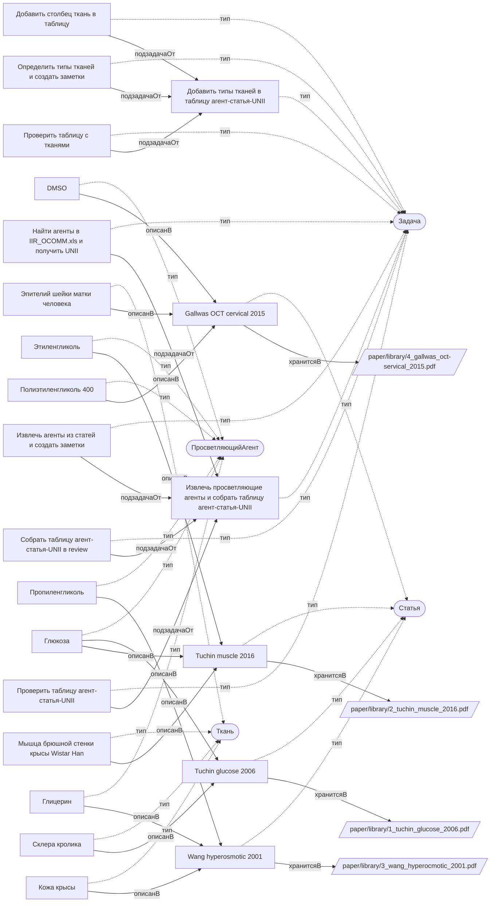

# Граф проекта

```mermaid
graph LR
  n0["Добавить типы тканей в таблицу агент-статья-UNII"]
  n1(["Задача"])
  n0 -.->|тип| n1
  n2["Добавить столбец ткань в таблицу"]
  n2 -.->|тип| n1
  n3["Определить типы тканей и создать заметки"]
  n3 -.->|тип| n1
  n4["Найти агенты в IIR_OCOMM.xls и получить UNII"]
  n4 -.->|тип| n1
  n5["Извлечь агенты из статей и создать заметки"]
  n5 -.->|тип| n1
  n6["Собрать таблицу агент-статья-UNII в review"]
  n6 -.->|тип| n1
  n7["Проверить таблицу агент-статья-UNII"]
  n7 -.->|тип| n1
  n8["Проверить таблицу с тканями"]
  n8 -.->|тип| n1
  n9["Извлечь просветляющие агенты и собрать таблицу агент-статья-UNII"]
  n9 -.->|тип| n1
  n10["Глюкоза"]
  n11(["ПросветляющийАгент"])
  n10 -.->|тип| n11
  n12["Gallwas OCT cervical 2015"]
  n13(["Статья"])
  n12 -.->|тип| n13
  n14["Эпителий шейки матки человека"]
  n15(["Ткань"])
  n14 -.->|тип| n15
  n16["Склера кролика"]
  n16 -.->|тип| n15
  n17["DMSO"]
  n17 -.->|тип| n11
  n18["Tuchin muscle 2016"]
  n18 -.->|тип| n13
  n19["Мышца брюшной стенки крысы Wistar Han"]
  n19 -.->|тип| n15
  n20["Кожа крысы"]
  n20 -.->|тип| n15
  n21["Этиленгликоль"]
  n21 -.->|тип| n11
  n22["Пропиленгликоль"]
  n22 -.->|тип| n11
  n23["Глицерин"]
  n23 -.->|тип| n11
  n24["Полиэтиленгликоль 400"]
  n24 -.->|тип| n11
  n25["Wang hyperosmotic 2001"]
  n25 -.->|тип| n13
  n26["Tuchin glucose 2006"]
  n26 -.->|тип| n13
  n2 -->|подзадачаОт| n0
  n3 -->|подзадачаОт| n0
  n4 -->|подзадачаОт| n9
  n5 -->|подзадачаОт| n9
  n6 -->|подзадачаОт| n9
  n7 -->|подзадачаОт| n9
  n8 -->|подзадачаОт| n0
  n10 -->|описанВ| n26
  n10 -->|описанВ| n18
  n27[/"paper/library/4_gallwas_oct-servical_2015.pdf"/]
  n12 -->|хранитсяВ| n27
  n14 -->|описанВ| n12
  n16 -->|описанВ| n26
  n17 -->|описанВ| n12
  n28[/"paper/library/2_tuchin_muscle_2016.pdf"/]
  n18 -->|хранитсяВ| n28
  n19 -->|описанВ| n18
  n20 -->|описанВ| n25
  n21 -->|описанВ| n18
  n22 -->|описанВ| n25
  n23 -->|описанВ| n25
  n24 -->|описанВ| n12
  n29[/"paper/library/3_wang_hyperocmotic_2001.pdf"/]
  n25 -->|хранитсяВ| n29
  n30[/"paper/library/1_tuchin_glucose_2006.pdf"/]
  n26 -->|хранитсяВ| n30
```
